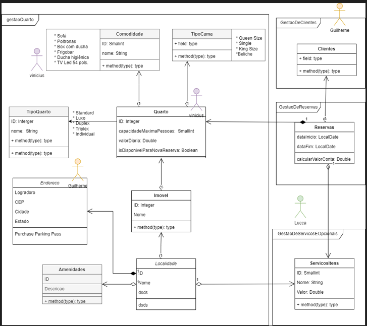

# HackathonFIAP2024TurmaA1DJT

**#######| Projeto do hackathon 2024, turma FIAP 1ADJT |############################################**

* Fiap turma: 1ADJT
* GRUPO: 60
    * Lucca Brito Gesteira - RM 349111
    *  Guilherme Franco - RM 350562
    *  Vinícius Miranda de Menezes - RM 348870

Desenvolvimento de um sistema WEB, com interfaces e APIs, para a startup de Sistemas de Hospitalidade.

Link para a gravação do video: https://www.youtube.com/watch?v=F-pwrdxn8ZE

# Estrutura do projeto
O sistema possui 3 módulos:
- Gestão de Quartos: src/main/java/br/com/fiap/postech/hackathon2024/gestaoquarto
- Gestão de Serviços e Opcionais: src/main/java/br/com/fiap/postech/hackathon2024/gestaoclientes
- Gestão de Reservas: src/main/java/br/com/fiap/postech/hackathon2024/gestaoreservas

Adicionalmente possui os seguintes serviços corporativos:
- Serviço de mensageria de e-mail: src/main/java/br/com/fiap/postech/hackathon2024/emailsender
- Controle de eventos de sistema: src/main/java/br/com/fiap/postech/hackathon2024/handlers

## Modelagem das entidades

A modelagem de negócio foi primeiramente toda desenvolvida na camada de entities, de cada módulo. A visão integrada
pode ser observada no diagrama de classes, divido por módulo. Conforme a seguir:
Diagrama de Classe - Entities x Modulos

--- 
Modelo entidade relacionamento do banco

lista de curl
curl -X GET http://localhost:8080/servicos-itens; \
curl -X POST http://localhost:8080/servicos-itens -H 'Content-Type: application/json' -d '{"nome": "Raquete de tênis", "valor": "120.00"}'; \
curl -X PUT http://localhost:8080/servicos-itens/31 -H 'Content-Type: application/json' -d '{"nome": "Refri", "valor": "9"}'; \
curl -X DELETE http://localhost:8080/servicos-itens/10; \
curl -X POST http://localhost:8080/reservas; \
curl -X GET http://localhost:8080/reservas; \
curl -X GET http://localhost:8080/reservas/1; \
curl -X PUT http://localhost:8080/reservas/1/itens-servicos -H 'Content-Type: application/json' -d '[1, 5, 7]'; \
curl -X PUT http://localhost:8080/reservas/1/itens-servicos -H 'Content-Type: application/json' -d '[1, 5, 7]'; \
curl -X PUT http://localhost:8080/reservas/1/datas?dataInicio=15-03-2024&dataFim=20-03-2024; \
curl -X GET http://localhost:8080/reservas/1/itens-servicos; \
curl -X GET http://localhost:8080/reservas/1/quartos; \
curl -X GET http://localhost:8080/reservas/1/itens-servicos/calcular-total; \
curl -X GET http://localhost:8080/reservas/1/itens-servicos/calcular-total; \
curl -X GET http://localhost:8080/reservas/1/quartos; \
curl -X GET http://localhost:8080/quartos; \
curl -X POST http://localhost:8080/quartos -H 'Content-Type: application/json' -d '{"capacidadeMaximaPessoas": "6", "valorDiaria": "550.00", "tipoQuarto": "LUXO", "isDisponivelParaNovaReserva": "true", "tiposCamas": ["SOLTEIRO", "CASAL"], "comodidades": ["FRIGOBAR", "SOFA", "TV_LED_54_POLS"]}'; \
curl -X GET http://localhost:8080/quartos
